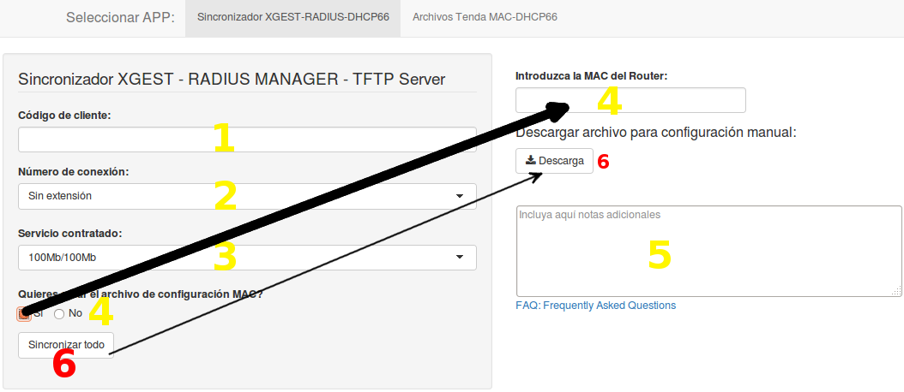

## Para qué sirve la aplicación web

La aplicación web sirve para sincronizar las bases de datos del **XGEST** contra las bases de datos **RADIUS Manager PPPoE** y **RADIUS Manager HotSpot**. Adicionalmente, podemos incluir la MAC del router para su autoconfiguración automática vía **DHCP66**.

## Uso de la aplicación web sincronizadora

En este apartado explicaremos el uso y la funcionalidad de esta aplicación web

#### Cómo usar la aplicación

1) Introducimos el **código de cliente**. Lo que hará la aplicación será **extraer información sobre el código de cliente escrito en la base de datos del XGEST**, así que es importante que sea correcto, puesto que si no, revertir el proceso es algo tedioso. Si el usuario no existe en el XGEST, la aplicación hará un _crash_ parcial, pudiendo recargar la WebApp directamente desde el navegador sin ninguna complicación.

2) Introducimos el **número de conexión**. Por lo general, se escogerá _Sin extensión_ para nuevos clientes. Si se escoge una conexión superior _(-2, -3, -4...)_, se creará una conexión adicional con un usuario PPPoE diferente, siempre con la misma contraseña.
Adicionalmente, se creará un usuario nuevo al RADIUS HotSpot si se escoge _Sin extensión_. Si elegimos alguna conexión diferente a la de _Sin extensión_, se añadirá ese número elegido como conexiones simultáneas vía HotSpot, es decir, que un cliente podrá usar **X conexiones simultáneas** conectándose a los WiFi Hotspot proporcionados por esta empresa con diferentes dispositivos. La velocidad será de **3 MB** en **cada** conexión. La contraseña será el número de móvil, o el fijo en su defecto. 

3) Seleccionamos **la velocidad contratada** para la conexión por cable.

4) Si decidimos añadir una **MAC**, se creará el archivo de configuración asociado, en la que el router se configurará automáticamente. Los archivos se envían al servidor _X.X.X.X_.

5) El campo de Notas se añadirá únicamente al campo de notas de RADIUS Manager. La contraseña en texto plano se añade automáticamente, no hace falta incluirla.

6) Por último, seleccionamos **Sincronizar todo** para que todo se ejecute y se sincronice. El botón que vemos de _Descarga_ es por si, tras conectar el router, el Router no se autoconfigurara, por lo que le introduciremos el archivo manualmente. Importante: Este botón de Descarga **sólo** funciona tras haberle dado a **Sincronizar todo**.

## ¿Y si ya existe el cliente/MAC en...

* **Radius Manager**: No se creará, lo único que hará será extraer los datos para la contraseña PPPoE. Sí que se creará si elegimos una conexión que no exista

* **Radius HotSpot**: No se creará, no importa si tiene un número diferente de conexión. Simplemente actualizará el "Simultaneous-Use" para ponerle el número de conexiones igual al número de conexión que tenga

* **TFTP Server**: Aunque exista el archivo MAC en la base de datos, sobreescribirá siempre el archivo de configuración.

_Nota_: Se puede usar este servicio como creador de archivos de configuración MAC aunque el cliente ya exista en las demás bases de datos

## Instalación/Update de los programas/servicios

Para nueva instalación, 

1) Instalar R: Como depende mucho del sistema y está en constante evolución, lo mejor es buscar en [google](http://lmgtfy.com/?q=R+ubuntu+install).

2) Instalar RStudio versión SERVER: La página oficial [aquí](http://www.rstudio.com/products/RStudio/#Server).

3) Instalar los paquetes necesarios para la WebApp: Dentro de RStudio (se inicia en el puerto 8787 por defecto) escribir:

> install.packages(c("shiny", "RMySQL", "digest", "stringr")) 

Para hacer un update de los paquetes que se utilizan se utiliza, en consola, la siguiente instrucción:

> update.packages()

Para iniciar en el crontab en cada reboot, la instrucción es la siguiente:

> @reboot R -e 'shiny::runApp(appDir = "/home/tecnico/WebApp", launch.browser = FALSE, port = 8080, host =  "0.0.0.0")'

## Troubleshooting

La mayor fuente de información se dará en los logs He incluido cada paso que da la aplicación junto a la hora. Si se congela la aplicación, lo más fácil será reiniciar el servidor, puesto que la WebApp se inicia automáticamente al iniciar el servidor.

Los logs se encuentran en _"/var/log/shiny-server.log"_ pero no comprenden la totalidad de la WebApp. Para ver todos los logs en modo muy verboso, comentar las líneas escritas en crontab, reiniciar el servidor, y iniciar manualmente desde dentro de RStudio con la sentencia. El log se borra cada vez que se pulsa al botón de _Sincronizar todo_.

> shiny::runApp(appDir = "/home/tecnico/WebApp", launch.browser = FALSE, port = 8080, host = "0.0.0.0")

Si el servidor es incapaz de llegar a los servidores del XGEST o ambos RADIUS la aplicación se detendrá por donde haya ocurrido el error. Primeramente llama al RADIUS Manager para obtener la lista de servicios disponibles. Luego llama al XGEST para obtener la información acerca del usuario. Luego llama de nuevo al RADIUS Manager para actualizarlo/extraer información. Luego al RADIUS HotSpot, y por último al servidor TFTP.

Sólo se permite tener un servidor Shiny activo. Por tanto si escribimos la sentencia que hemos escrito más arriba, dará un error.

Si el error se encuentra en la parte de la creación del archivo de configuración, puede ser por un fallo al comunicarse con el _X.X.X.X_, o también puede ser por error de la aplicación, al no reconocer el archivo recién creado. Esto último se soluciona reiniciando el servidor.
